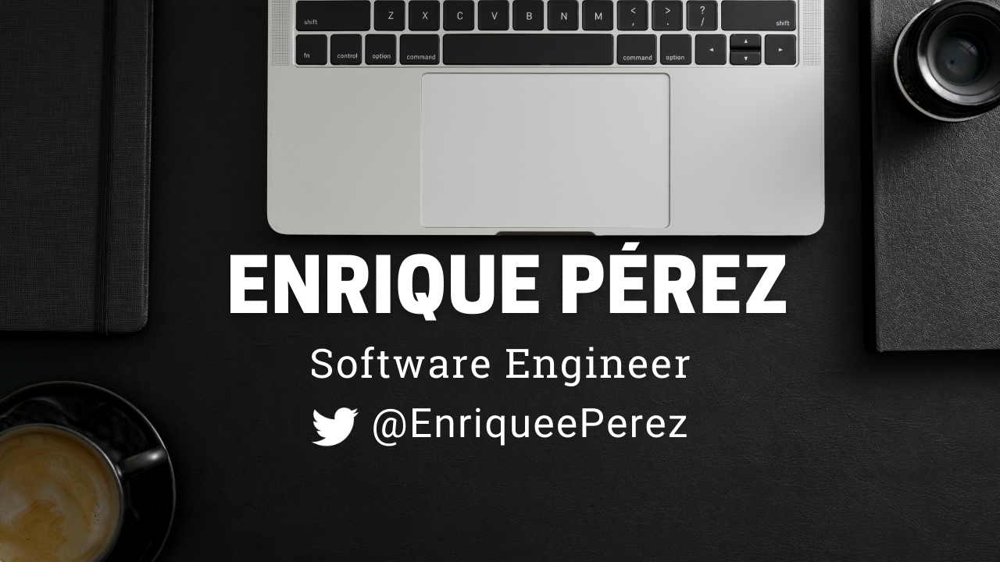

&nbsp;&nbsp;&nbsp;&nbsp;
  &nbsp;&nbsp;&nbsp;
  &nbsp;
  &nbsp;&nbsp;&nbsp;&nbsp;
  &nbsp;&nbsp;&nbsp;&nbsp;

<h1 align="center">Hey, nice to see you 👨‍💻, if you like my profile, contact <a href="mailto:hi@enriqueeperez.com">me</a></h1>

<h3>About me</h3>

I am a Software Engineer focused on create helpful, remarkable and scalable applications. Always thinking on the final user to give a quality product by choosing the right technologies according on the product requirements.

---

<h3>Tecnologies that I used</h3>
 
<h4 align='center'><strong>Languages</strong></h4>
 

 
<h4 align='center'><strong>Databases</strong></h4>
 

 
<h4 align='center'><strong>Frameworks</strong></h4>
 

<h4 align='center'><strong>Cloud</strong></h4>
 

 
<h4 align='center'><strong>Other Technologies</strong></h4>
 

---

<h3>Projects</h3>

In my free time I like to make some projects, here you can check some of my most recent works

<ul>
<li><a href="https://opencontractmx.netlify.app/" target='_blank'>OpenContractMX</a> - <a href="https://github.com/OpenContractMX" target='_blank'>Github</a></li>
<li><a href="https://purojekuto-master.herokuapp.com/" target='_blank'>Purojekuto</a> - <a href="https://github.com/Purojekuto-Capstone" target='_blank'>Github</a></li>
</ul>

---

<h3>GitHub Stats</h3>
 

 

